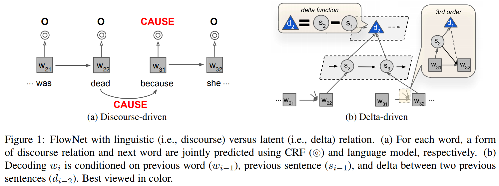

# FlowNet
Data and code for ["Linguistic Versus Latent Relations for Modeling a Flow in Paragraphs"](https://arxiv.org/abs/1908.11790) by Dongyeop Kang, Hiroaki Hayashi, Alan W Black, and Eduard Hovy, EMNLP 2019




## Dependency
 - tensorflow
 - nltk
 - gensim
 - nlgeval
 
## Notes
 - (Aug 2019) This repository is not heavily tested due to the major refactoring of flownet with pytorch and transfomers. Please stay tuned for the new pytorch version of flownet.


## Dataset preparation
Once you download the [PeerRead](https://github.com/allenai/PeerRead) and [BookCorpus](https://github.com/soskek/bookcorpus) datasets, preprocess them using the scripts under ```prepare_{arxiv,book}.py```. For discourse relations, we parse each paragraph using [DPLP](http://github.com/jiyfeng/DPLP). The final dataset looks like below: one from BookCorpus's SciFi and other from PeerRead's paper. 
```
[Category] \t [ID] \t [Paragraph Length] \t [Avg Sentence Length] \t [Paragraph #1] \t ... [Paragraph #7] \t [Flattened RST tree]
Science_fiction	u3633	7	13.86	" Don ' t talk to him , " Baasen snapped .	Dark blooms appeared on his yellow-green cheeks .	" If you talk to anyone , you talk to me , and you don ' t talk to me .	You just march yourself to the ship .	I ' ve been kind not to break you .	Jabba don ' t care if you still got knees when you reach him .	So don ' t- "	( NS-elaboration ( EDU " Don ' t talk to him , " Baasen snapped . )  ( NN-list ( EDU Dark blooms appeared on his yellow-green cheeks . )  ( NS-elaboration ( EDU " If you talk to anyone , you talk to me , and you don ' t talk to me . )  ( NS-elaboration ( EDU You just march yourself to the ship . )  ( NN-list ( NS-elaboration ( EDU I ' ve )  ( EDU been kind not to break you . )  )  ( NN-list ( NS-elaboration ( EDU Jabba don ' t )  ( NS-condition ( EDU care )  ( SN-condition ( EDU if you still got knees )  ( EDU when you reach him . )  )  )  )  ( NS-elaboration ( EDU So don ' t- )  ( EDU " )  )  )  )  )  )  )  )
1. Introduction	1405.7908	4	15.75	Comp and Decomp are variations on the unsupervised learning algorithm of Turney ( 2012 ) .	Super is based on the supervised algorithm of Turney ( 2013 ) .	These algorithms were originally designed for the recognition task .	The main contribution of this paper is to show that , working together , the algorithms can scale up from recognition to generation .	( NS-elaboration ( EDU Comp and Decomp are variations on the unsupervised learning algorithm of Turney ( 2012 ) . )  ( NS-elaboration ( NS-elaboration ( EDU Super is based on the supervised algorithm of Turney ( 2013 ) . )  ( EDU These algorithms were originally designed for the recognition task . )  )  ( SN-attribution ( EDU The main contribution of this paper is to show )  ( EDU that , working together , the algorithms can scale up from recognition to generation . )  )  )  )
```

## Models
In order to experiment with (and hopefully improve) our models, you can run following commands:

To run flownet with delta relations, run 
```
    python train_lm.py \
        --data_path ${DATA_PATH} \
        --dataset ${DATASET_NAME} \
        --model_path ${MODEL_PATH} \
        --model_name drnn
```

To run flownet with discourse relations, run 
```
    python train_clm.py \
        --data_path ${DATA_PATH} \
        --dataset ${DATASET_NAME} \
        --model_path ${MODEL_PATH} \
        --model_name rstseq2seq
```

You can add ```--reload``` or ```--test``` options to reload the pre-trained model or test on testing data, respectively. 


## Citation
    
    @inproceedings{kang19emnlp_flownet,
      title = {Linguistic Versus Latent Relations for Modeling a Flow in Paragraphs},
      author = {Dongyeop Kang and Hiroaki Hayashi and Alan W Black and Eduard Hovy},
      booktitle = {Conference on Empirical Methods in Natural Language Processing (EMNLP)},
      address = {Hong Kong},
      month = {November},
      url = {https://arxiv.org/abs/1908.11790},
      year = {2019}
    }

## Acknowledgement
 - We also thank Jason Weston, Dan Jurafsky, and anonymous reviewers for their helpful comments.

